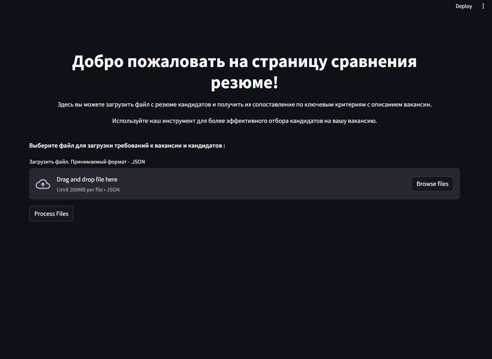

**Описание проекта**

Этот проект представляет собой систему сравнения резюме кандидатов с требованиями вакансии. Он разработан для упрощения процесса отбора кандидатов на вакансию путем автоматического сопоставления навыков и опыта, указанных в резюме, с требованиями, представленными в описании вакансии.

1) Склонируйте репозиторий:
git clone https://github.com/AndreiXaker/ResumeAnaliz.git

2) Откройте папку:
   cd ResumeAnaliz
   
4) Установите необходимые библиотеки:
   pip install -r requirements.txt

5) Запустите файл:
   python main.py

6) Выберите файл для загрузки требований к вакансии и кандидатов JSON формата

7) Нажмите Process Files
